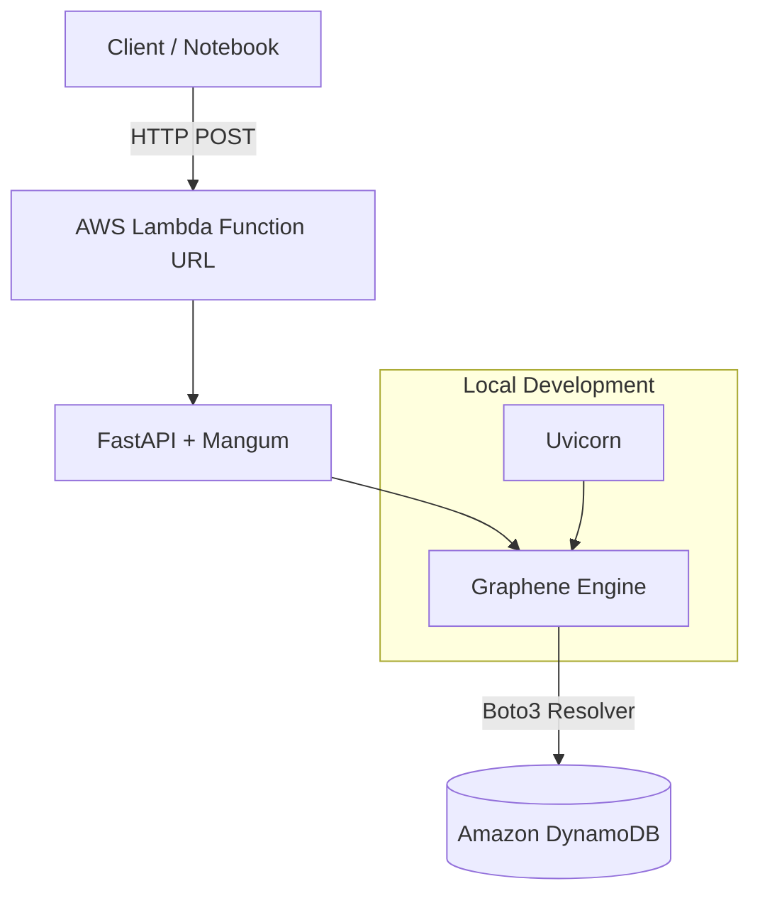

[](https://www.python.org/)
[](https://graphene-python.org/)
[](https://aws.amazon.com/dynamodb/)

# GraphQL Python MVP (Graphene + AWS)
Este es un proyecto Mínimo Viable (MVP) desarrollado para demostrar la integración de GraphQL con Python en un entorno Serverless de AWS. El objetivo principal es practicar la implementación de esquemas "Code-First" integrando las tecnologias de referencia y realizar el despliegue de infraestructura como código (IaC).

## 🏗️ Arquitectura del Proyecto

## 🚀 Características Principales
- GraphQL Engine: Implementado con Graphene siguiendo un enfoque Code-First.

- Web Framework: FastAPI para una ejecución asíncrona y eficiente.

- Infraestructura: Desplegada totalmente con Terraform.

- Cloud Native: Ejecución en AWS Lambda con persistencia en DynamoDB.

- Dual Mode: Soporte para ejecución local en Linux (Mocking) y despliegue real en la nube.

## 🛠️ Tecnologías Utilizadas
- Componente Tecnología Lenguaje:
Python 3.11 + API Graphene, FastAPI, Ariadne (ASGI) 
- Infraestructura: TerraformAWS
- Services: Lambda, DynamoDB, IAM
- Herramientas: Boto3, Mangum, Uvicorn

## 📦 Instalación y Ejecución Local
Clonar y configurar entorno:
```bash
git clone <tu-repo-url>
python3 -m venv venv
source venv/bin/activate
pip install -r requirements.txt
```

Correr servidor de desarrollo:
```bash
uvicorn app:app --host 0.0.0.0 --port 8000
```
Acceder desde el navegador a http://localhost:8000 para abrir el GraphQL Playground.

## ☁️ Despliegue en AWS
Para desplegar este proyecto en tu propia cuenta de AWS:

### Preparar el paquete:
```bash
pip install --target ./package -r requirements.txt
cd package && zip -r ../function.zip . && cd ..
zip function.zip app.py
```

### Terraform:
```bash
terraform init
terraform apply
```

## 📈 Próximos Pasos (Evolución)
Este proyecto es una base que planeo escalar con las siguientes funcionalidades:

[ ] Implementación de Relaciones (User -> Items).

[ ] Agregar Autenticación vía AWS Cognito o JWT.

[ ] Configuración de CI/CD con GitHub Actions para despliegue automático.

[ ] Manejo avanzado de errores y validaciones personalizadas en Graphene.


