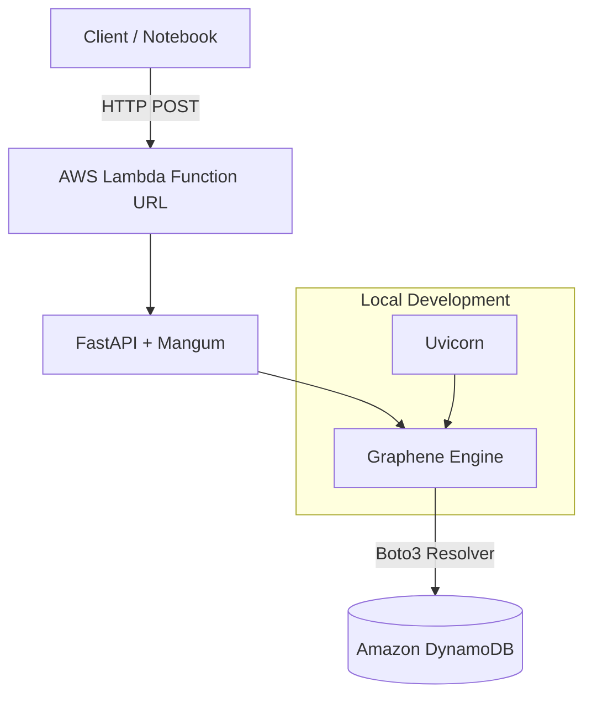

[](https://www.python.org/)
[](https://graphene-python.org/)
[](https://aws.amazon.com/dynamodb/)

# GraphQL Python MVP (Graphene + AWS)
This is a Minimal Viable Product (MVP) project developed to demonstrate integrating GraphQL with Python in an AWS Serverless environment. The main goal is to practice implementing "Code-First" schemas using reference technologies and to deploy infrastructure as code (IaC).

## 🏗️ Project Architecture

## 🚀 Key Features
- GraphQL Engine: Implemented with Graphene following a Code-First approach.

- Web Framework: FastAPI for efficient asynchronous execution.

- Infrastructure: Fully deployed using Terraform.

- Cloud Native: Runs on AWS Lambda with persistence in DynamoDB.

- Dual Mode: Supports local execution on Linux (mocking) and real cloud deployment.

## 🛠️ Technologies Used
- Language / Core: Python 3.11 + Graphene API, FastAPI, Ariadne (ASGI)
- Infrastructure: Terraform (AWS)
- Services: Lambda, DynamoDB, IAM
- Tools: Boto3, Mangum, Uvicorn

## 📦 Local Installation & Run
Clone and configure the environment:
```bash
git clone <tu-repo-url>
python3 -m venv venv
source venv/bin/activate
pip install -r requirements.txt
```

Run the development server:
```bash
uvicorn app:app --host 0.0.0.0 --port 8000
```
Open http://localhost:8000 in your browser to access the GraphQL Playground.

## ☁️ Deployment to AWS
To deploy this project to your own AWS account:

### Prepare the package:
```bash
pip install --target ./package -r requirements.txt
cd package && zip -r ../function.zip . && cd ..
zip function.zip app.py
```

### Terraform:
```bash
terraform init
terraform apply
```

## 📈 Next Steps (Roadmap)
This project is a foundation I plan to extend with the following features:

- [ ] Implement relationships (User -> Items).

- [ ] Add authentication via AWS Cognito or JWT.

- [ ] Configure CI/CD with GitHub Actions for automated deployments.

- [ ] Advanced error handling and custom validations in Graphene.


